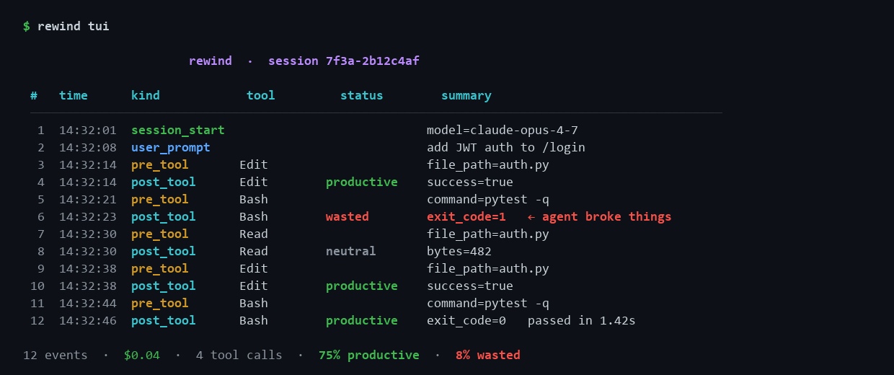
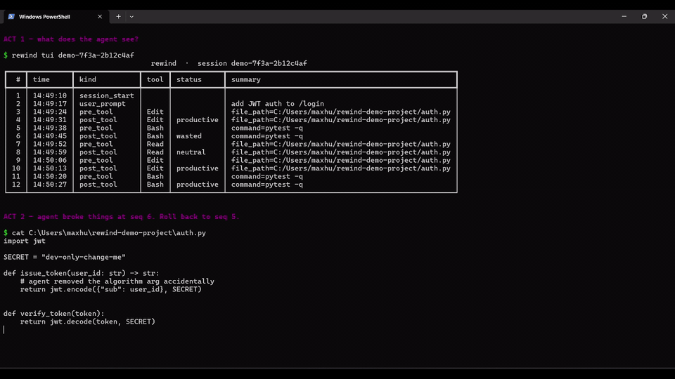

# rewind

> Time-travel debugger and shareable replay for Claude Code sessions.



> **[Watch the 30-second live demo (MP4 · 691 KB)](docs/images/demo.mp4)**

```bash
pip install rewindx       # PyPI package; binary is `rewind`
rewind cc setup           # wires up Claude Code hooks (idempotent)
# ...use Claude Code normally...
rewind tui                # browse the most recent session
rewind goto 6             # restore the file system to just before event #6
rewind export --format markdown --out session.md
```

Local-first, no API keys, MIT licensed.

## What it does

Claude Code does dozens of tool calls per session. The agent's transcripts
are JSONL, hard to read, and impossible to *replay*. `git diff` shows files
but not the reasoning. When the agent breaks something subtle, you have
nothing to fall back on. `rewind` closes that loop:

- **Observability** — every prompt, tool call, file edit, and cost
  recorded in a per-session SQLite event store with content-addressed
  blobs.
- **Recovery** — `rewind goto <seq>` restores the file system to any prior
  point. Each rollback creates a checkpoint so `rewind undo` is one
  command:

  

- **Shareable replay** — `rewind export` renders the session as a
  privacy-masked Markdown or text transcript. (GIF and MP4 backends ship
  in 0.2.)

## Status

Pre-launch alpha (v0.1.0). The core pipeline is production-grade: 131
tests, 87% branch coverage, mypy strict, ruff clean, multi-OS / multi-Py
CI. The non-interactive TUI is what you see above; full scrubbable TUI
lands in 0.2.

## What it captures

| Hook              | Stored event   | Snapshots                                                |
|-------------------|----------------|----------------------------------------------------------|
| SessionStart      | `session_start`| —                                                        |
| UserPromptSubmit  | `user_prompt`  | —                                                        |
| PreToolUse        | `pre_tool`     | before-content of every Edit / Write / MultiEdit path    |
| PostToolUse       | `post_tool`    | after-content + classification (productive / wasted / neutral) |
| Stop              | `session_end`  | totals (cost, tokens, events)                            |

## CLI

```text
rewind --version
rewind cc {setup,uninstall,status} [--scope user|project]
rewind capture {session-start,user-prompt,pre-tool,post-tool,session-end}    # reads stdin
rewind sessions {list,show,delete}
rewind tui [SESSION_ID] [--seq N]
rewind goto SEQ [--session ID] [--cwd PATH] [--force] [--dry-run]
rewind undo
rewind stats [SESSION_ID] [--json]
rewind export [SESSION_ID] [--format text|markdown] [--out PATH] [--no-mask]
```

## Storage layout

```
~/.rewind/
├── config.toml                  # optional, all fields have sensible defaults
├── current_session.txt          # active session id
├── checkpoints/                 # one JSON per rollback (used by `rewind undo`)
└── sessions/
    └── <session_id>/
        ├── events.db            # SQLite, WAL mode, schema v1
        └── blobs/<aa>/<bb>/<sha256>
```

Per-session storage isolates blast radius: deleting one session is one
`rm -rf`, nothing else is affected.

## Privacy

- Local-only: zero network calls. No telemetry. Ever.
- `rewind export` masks file contents to head/tail and redacts env-shaped
  secrets by default. Pass `--no-mask` to opt out explicitly.
- Add `.rewind/` to `.gitignore` if you keep a per-project home.

## Documents

- [PLAN.md](PLAN.md) — product plan and pitch
- [docs/ARCHITECTURE.md](docs/ARCHITECTURE.md) — schemas, data flow, modules
- [docs/ROADMAP.md](docs/ROADMAP.md) — six-phase roadmap
- [docs/LAUNCH.md](docs/LAUNCH.md) — pre-launch + launch playbook
- [docs/DECISIONS.md](docs/DECISIONS.md) — ADRs
- [docs/NAMING.md](docs/NAMING.md) — name candidates and verification
- [CHANGELOG.md](CHANGELOG.md)
- [CONTRIBUTING.md](CONTRIBUTING.md)

## Sister projects

`rewind` is one corner of an ecosystem of open-source tools for Claude Code:

| Project    | Concern                  | Repo                                    |
|------------|--------------------------|-----------------------------------------|
| `spent`    | cost tracking            | https://github.com/loplop-h/spent       |
| `debtx`    | code quality             | https://github.com/loplop-h/debtx       |
| `mcpguard` | MCP security             | https://github.com/loplop-h/mcpguard    |
| `rewind`   | observability + recovery | (this repo)                             |

## License

MIT.
